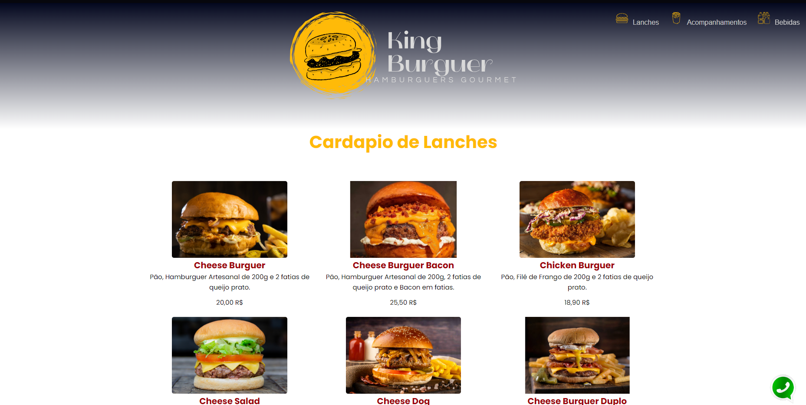

# 🍔 Fast Food - King Burguer

Este é um projeto desenvolvido para a disciplina de Front-End no curso de Análise e Desenvolvimento de Sistemas. O objetivo é criar um site de um fast food fictício utilizando tecnologias web.

---
## 🚀 Tecnologias Utilizadas

- HTML5
- CSS3

---
## 📸 Captura de Tela do Site

<p >
  
</p>

---
## 📋 Funcionalidades

- Cardápio completo.
- Botão de contato WhatsApp.

---
## 📂 Estrutura do Projeto

```text
/
├── index.html          (Página inicial)
├── css/
│   ├── style.css       (Estilo principal)
├── img/
│   ├── logo.png        (Logo do fast food)
│   ├── (outras imagens)
└── README.md           (Este arquivo)
```

---
## 🎓 Sobre o Projeto
Este projeto foi desenvolvido como atividade avaliativa da disciplina de Front-End, ministrada pelo professor Leonardo Rocha. O objetivo foi aplicar os conhecimentos de estruturação de páginas e estilização.

---
## 💻 Como Executar
Clone o repositório:<br>
git clone https://github.com/seu-usuario/nome-do-repositorio.git
<br>Acesse a pasta do projeto e abra o index.html diretamente no navegador.

---
## ✨ Autores
Rogher Adriano Soares - RA: 24263225-2 

---
## 📝 Licença (opcional)
Este projeto foi desenvolvido para fins educacionais.
