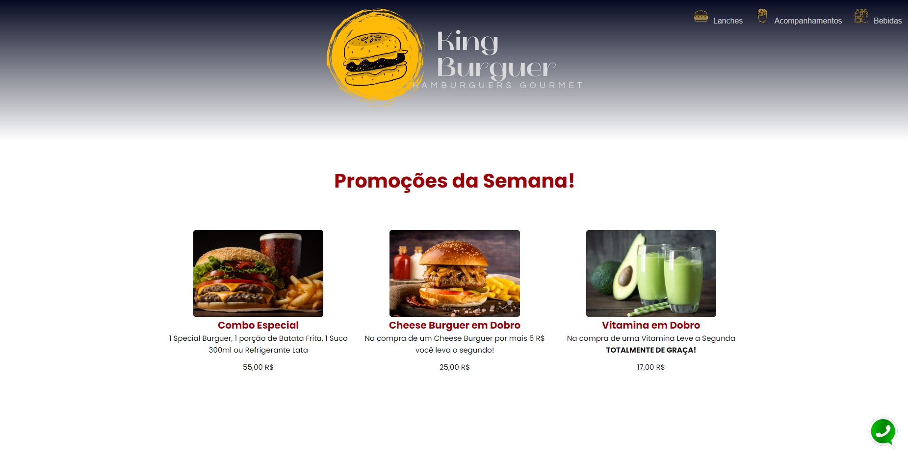
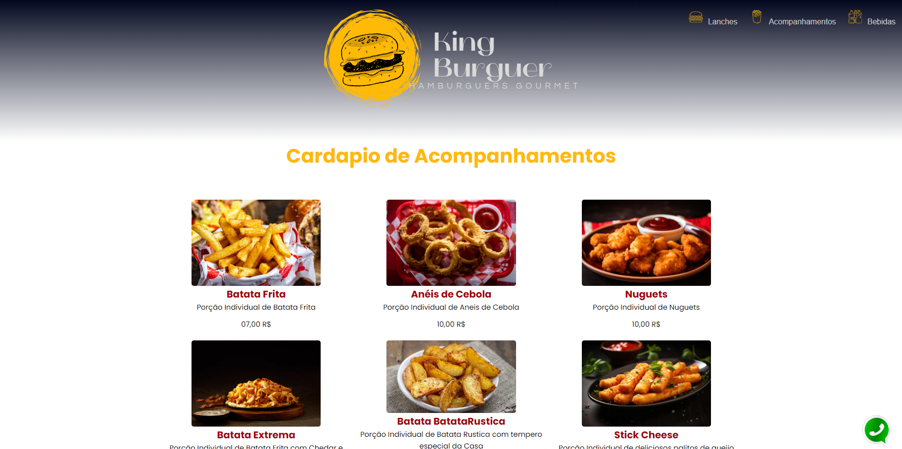
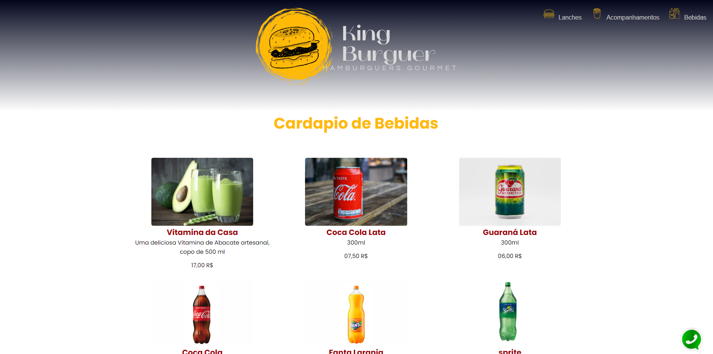
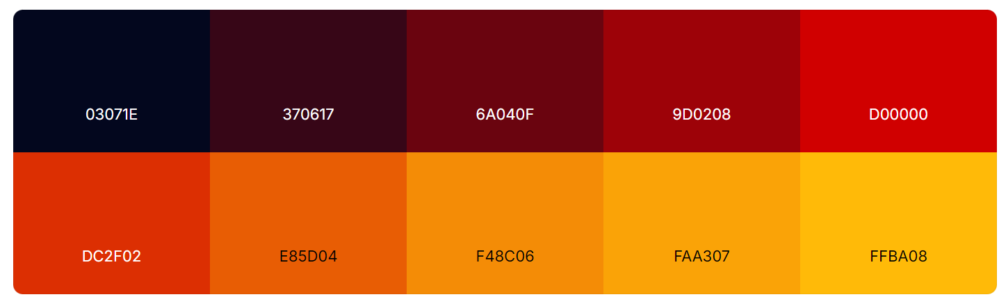
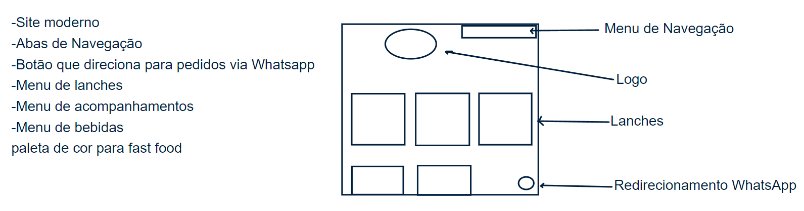
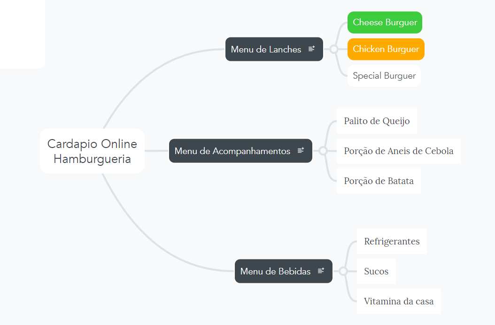

# 🍔 Fast Food - King Burguer

Este é um projeto desenvolvido para a disciplina de Front-End no curso de Análise e Desenvolvimento de Sistemas. O objetivo é criar um site de um fast food fictício utilizando tecnologias web.

---
## 🚀 Tecnologias Utilizadas

- HTML5
- CSS3

---
## 📸 Captura de Tela do Site

  <br>
  <br>
  <br>
  <br>

---
## 📋 Funcionalidades

- Cardápio completo.
- Botão de contato WhatsApp.

---
## 📂 Estrutura do Projeto

```text
/
├── index.html          (Página inicial)
├── css/
│   ├── style.css       (Estilo principal)
├── img/
│   ├── logo.png        (Logo do fast food)
│   ├── (outras imagens)
└── README.md           (Este arquivo)
```

---
## 🎓 Sobre o Projeto
Este projeto foi desenvolvido como atividade avaliativa da disciplina de Front-End, ministrada pelo professor Leonardo Rocha. O objetivo foi aplicar os conhecimentos de estruturação de páginas e estilização.<br><br>
Depois da primeira conversa com a Maria (Persona) sobre suas idéias, foi decidido que o estabelecimento seria uma Hamburgueria Gourmet.<br>
Para uma Hamburgueria Gourmet nada melhor que um site moderno e minimalista e que seja intuitivo, sem esquecer de seguir uma paleta de cores ideal para fast food e o botão que direciona o cliente para realizar o pedido no WhatsApp.<br>

<br>

Paleta de cores usada como referencia, para que houvesse harmonia nas cores, tendo em vista que o vermelho e o amarelo são cores bem comuns nos fast foods.<br>

<br>

Seguindo as exigências da persona ao entrar no site deveria haver um menu de navegação com 3 opções:<br>
- Lanches
- Acompanhamentos
- Bebidas 

Cada um desses menus deveria levar a sua respectiva categoria. <br>

<br>

Assim chegamos no site que foi apresentado mais acima neste mesmo documento.

---
## 💻 Como Executar
Clone o repositório:<br>
git clone https://github.com/RogherSoares/Fastfood
<br>Acesse a pasta do projeto e abra o index.html diretamente no navegador.

---
## ✨ Autores
Rogher Adriano Soares - RA: 24263225-2 

---
## 📝 Licença 
Este projeto foi desenvolvido para fins educacionais.
